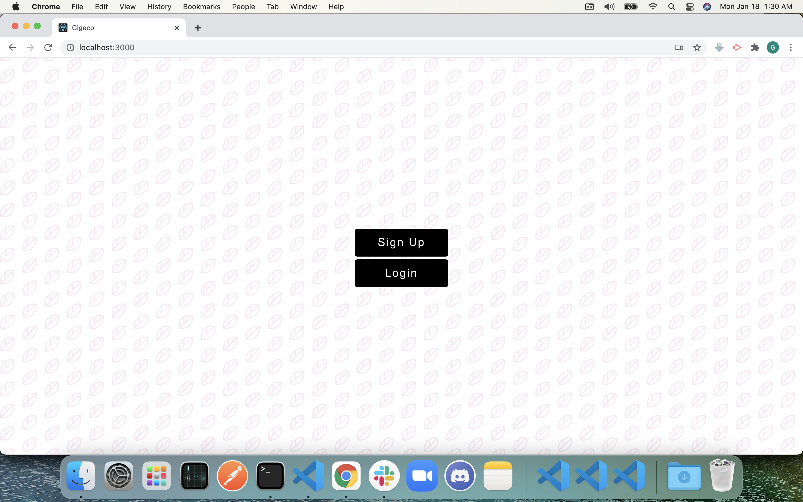
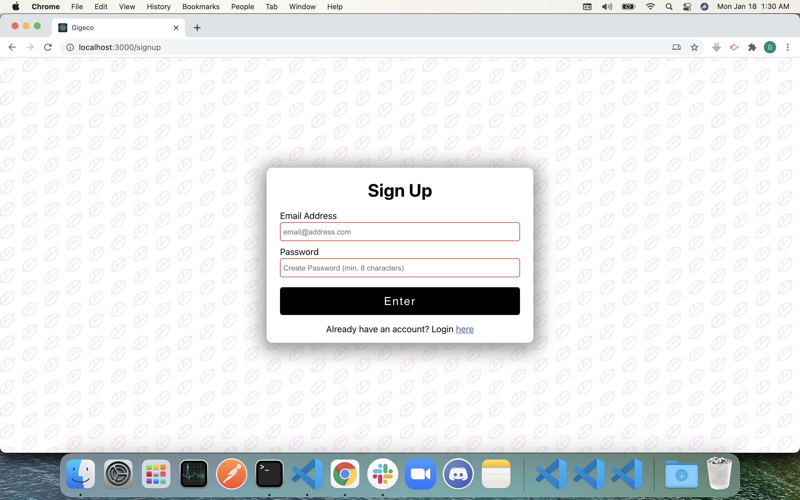
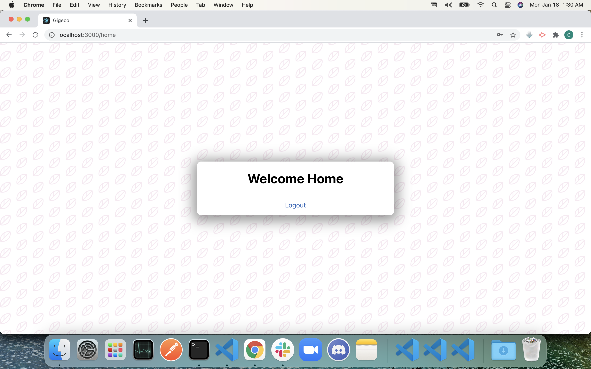

# Gigeco Take Home Assignment
This is a simple front-end app interface. Users can sign up for an account, login into the homepage, and logout. It is built with HTML, CSS, Node.js, React, and [memberstack](https://www.memberstack.io) as the backend.

## Final Product
In the landing page, users can choose to either sign up for an account, or log in to an existing account.

First time users can sign up for an account with their email address. The password must be at least 8 characters in length.

After signing up, users will be directed to the a sample homepage. User can logout by clicking on "Logout" link.
